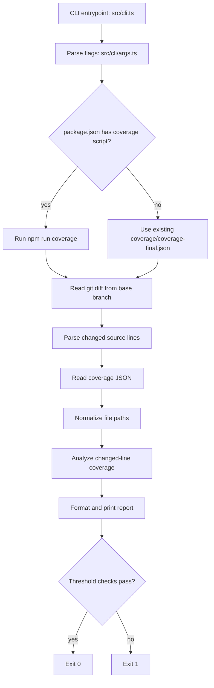
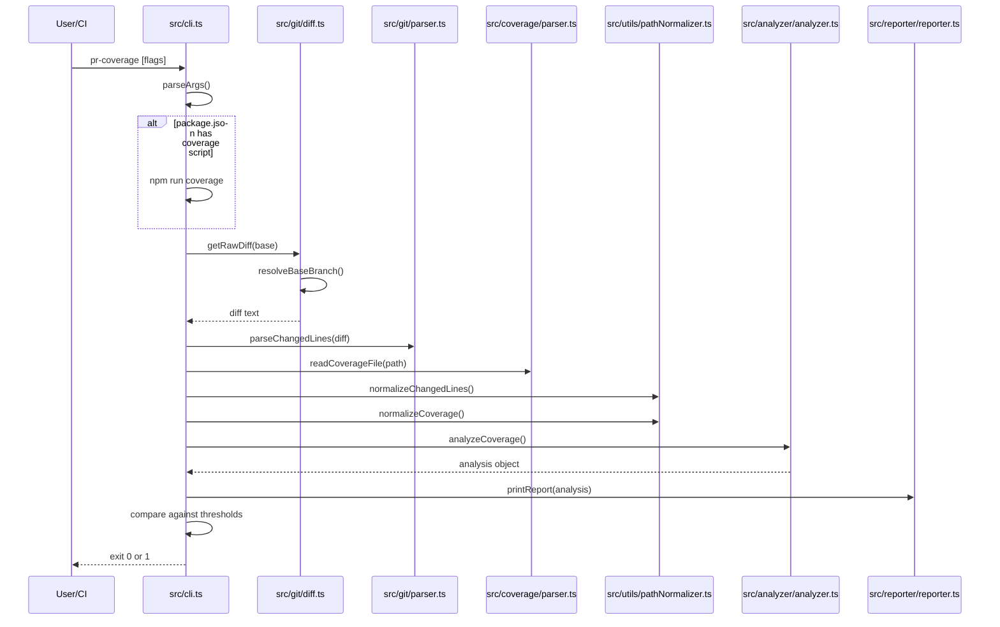

# pr-coverage Architecture

This document explains how `pr-coverage` works today: what the CLI supports, how the execution flows through the codebase, how changed lines and coverage data are parsed, and how the final report and exit code are produced.

## Purpose

`pr-coverage` measures coverage for only the lines changed in a pull request. It does this by combining:

1. The Git diff between a base branch and `HEAD`
2. A Vitest/Istanbul-style coverage report
3. A line-by-line analyzer that decides what changed lines are covered

The tool is designed for CI and local use, and it exits non-zero when coverage is below the configured threshold.

## High-Level Layout

The runtime path is small and linear:



## Supported Command Surface

The CLI entrypoint is the `pr-coverage` binary defined in `package.json`.

Supported flags in the current code:

- `--base <branch>`: base branch used for the Git diff
- `--coverage <path>`: path to the coverage JSON file
- `--min <number>`: minimum required line coverage percentage
- `--min-branches <number>`: optional branch coverage threshold
- `--min-functions <number>`: optional function coverage threshold

Default values:

- Base branch: `main`
- Coverage file: `coverage/coverage-final.json`
- Minimum line coverage: `80`

Runtime behavior:

- If `package.json` contains a `coverage` script, the CLI runs `npm run coverage` before analysis.
- If no `coverage` script exists, it uses the existing coverage file and prints a warning.
- If the requested base branch does not exist, it falls back to `main`, then `master`.

## Entry Point

The main orchestration happens in [src/cli.ts](./src/cli.ts).

Key responsibilities:

- Parse CLI args
- Decide whether to generate fresh coverage
- Fetch the Git diff
- Parse changed lines
- Read and normalize coverage data
- Run the analyzer
- Print the report
- Enforce exit thresholds

### Main Control Flow



## CLI Argument Parsing

Implemented in [src/cli/args.ts](./src/cli/args.ts).

Parsing is intentionally simple and positional:

- It iterates through `process.argv.slice(2)`
- Each recognized flag reads the next token as its value
- Unknown flags are ignored
- Invalid numeric values for `--min` reset to the default `80`

Important details:

- `--base` changes the branch used for the diff
- `--coverage` changes the input file path
- `--min` controls the line-coverage failure threshold
- `--min-branches` and `--min-functions` are optional, but supported by the analyzer path

There is no long-form config file, environment-variable layer, or subcommand system.

## Git Diff Resolution

Implemented in [src/git/diff.ts](./src/git/diff.ts).

### Base Branch Selection

The tool resolves the diff base in this order:

1. The requested branch
2. `main`
3. `master`

This logic exists so the CLI remains usable in repositories that still use `master`, or in situations where the caller asks for a branch name that is unavailable locally.

If the requested branch is not the one used, the tool writes a warning to stderr.

### Diff Command

The actual diff command is:

```bash
git diff <base>...HEAD --unified=0
```

The `--unified=0` option is important because the parser only needs exact changed line numbers, not context lines.

## Diff Parsing

Implemented in [src/git/parser.ts](./src/git/parser.ts).

The diff parser does two distinct things:

1. It extracts file names from `diff --git` headers
2. It walks hunk bodies to calculate added line numbers

### Supported Source Files

Only these file types are considered source:

- `.ts`
- `.tsx`
- `.js`
- `.jsx`
- `.mjs`
- `.cjs`

Files outside those extensions are ignored even if they appear in the diff.

### What Counts as a Changed Line

The parser tracks the current file and the current line number inside each hunk. For each added line:

- If the line looks executable, the line number is recorded
- If the line is considered non-executable, it is skipped
- The current line counter still advances either way

### Non-Executable Added Lines

The parser ignores additions that match these patterns:

- `import ...`
- `require(...)`
- `export type ...`
- `export interface ...`
- `export { ... } from ...`

This matters because such lines often should not count against changed-line coverage.

### Hunk Behavior

For each `@@` hunk header, the parser resets to the new added-line start line. As it walks the body:

- `+` lines increment the added-line cursor
- ` ` lines increment the cursor as context
- removed lines are not counted as changed lines

### Output Shape

The parser returns:

```ts
Map<string, Set<number>>
```

Where:

- key = file path from the diff
- value = set of changed line numbers in that file

## Coverage File Parsing

Implemented in [src/coverage/parser.ts](./src/coverage/parser.ts).

The parser reads a JSON coverage file and converts it into a normalized line-coverage map:

```ts
Map<string, Map<number, LineCoverage>>
```

Where `LineCoverage` contains:

- `isStatementCovered`
- `branches`
- `isFunctionCovered`

### Supported Coverage Shapes

The parser supports two statement coverage shapes:

- `l`: line hits keyed by line number
- `statementMap` + `s`: Istanbul-style statement map and hit counts

It also supports:

- `branchMap` + `b` for branch coverage
- `fnMap` + `f` for function coverage

### Statement Coverage

Statement coverage is interpreted line by line:

- With `l`, each line hit count becomes a covered/uncovered line
- With `statementMap` + `s`, the statement span is expanded across all lines in the statement range

This is why a multi-line statement can mark several lines as statement-covered.

### Branch Coverage

For each branch:

- The parser reads the branch location line
- It counts how many branch paths have hits greater than zero
- It stores `{ total, covered }` on that line

Branch coverage is attached to the line where the branch is reported, not to all lines in the statement span.

### Function Coverage

For each function:

- The parser reads the function line
- It marks the line as function-covered or function-uncovered
- Multiple functions on the same line are merged with logical OR

### File Omission Behavior

If a file produces no line coverage entries after parsing, it is omitted from the result map.

## Path Normalization

Implemented in [src/utils/pathNormalizer.ts](./src/utils/pathNormalizer.ts).

The Git diff and the coverage report often use different path styles:

- Git may emit repo-relative paths
- Coverage may emit absolute paths
- Windows paths may include backslashes

Normalization makes both sides comparable.

### Normalization Rules

- Absolute paths are converted to paths relative to the project root
- Relative paths are left as-is
- Backslashes are converted to forward slashes

The CLI normalizes both:

- changed-line paths from the diff
- coverage paths from the JSON report

## Analyzer

Implemented in [src/analyzer/analyzer.ts](./src/analyzer/analyzer.ts).

This is the core decision engine. It compares:

- changed line numbers from the diff
- coverage data for the same file and line

### Per-Line Logic

For each changed line, the analyzer decides whether the line is fully covered.

The decision order is:

1. Check whether coverage exists for the file and line
2. Check whether the statement is covered
3. Aggregate branch hits for that line
4. Aggregate function coverage for that line

If any required signal indicates the line is uncovered, it is reported as uncovered.

### Uncovered Reasons

The analyzer records a reason for uncovered lines:

- `statement`
- `branch`
- `function`
- `untracked`

`untracked` means the diff found the line, but no coverage entry exists for it.

### Aggregate Metrics

The analyzer returns both file-level and overall metrics:

- `changedFiles`
- `changedLines`
- `coveredLines`
- `coveragePercent`
- `branchesTotal`
- `branchesCovered`
- `branchPercent`
- `functionsTotal`
- `functionsCovered`
- `functionPercent`

### Threshold Behavior

The CLI currently enforces:

- `coveragePercent >= --min`
- if any branches exist, `branchPercent >= --min-branches || --min`
- if any functions exist, `functionPercent >= --min-functions || --min`

This means branch/function thresholds are only relevant when corresponding data exists.

## Reporter

Implemented in [src/reporter/reporter.ts](./src/reporter/reporter.ts).

The reporter is presentation-only. It does not change any logic or thresholds.

### Report Content

It prints:

- changed files
- changed lines
- covered lines
- line coverage percentage
- branch coverage percentage if branch data exists
- function coverage percentage if function data exists
- uncovered paths and line numbers

### Output Formatting Rules

- Statement or untracked misses print as `file:line`
- Branch or function misses print as `file:line (Missing branch coverage)` or `file:line (Missing function coverage)`

The report is intentionally plain text so it works well in CI logs.

## Exit Codes

The process exits with:

- `0` when coverage meets all enforced thresholds
- `1` when coverage is below threshold, the coverage file cannot be read, or a Git operation fails

The CLI uses `process.exit(...)` directly after printing the final report or an error.

## Tested Behavior

The repository has tests for the main units:

- CLI argument parsing
- Git diff parsing
- Coverage analysis
- Report formatting
- Path normalization
- Base-branch resolution
- Coverage JSON parsing

The integration test covers the end-to-end shape of the current command flow.

## Practical Execution Path

When a developer or agent runs `pr-coverage`, this is the sequence that matters:

1. Read flags from the command line
2. Optionally regenerate coverage with `npm run coverage`
3. Resolve a usable base branch
4. Generate a zero-context Git diff against `HEAD`
5. Parse only changed source lines
6. Load Istanbul/Vitest JSON coverage
7. Normalize file paths so diff and coverage refer to the same files
8. Compare changed lines with coverage line data
9. Render a human-readable summary
10. Exit based on the configured thresholds

## Notes for Maintainers

- The README currently documents the basic flags, but the code also supports `--min-branches` and `--min-functions`.
- The diff parser is deliberately conservative: it only counts executable source-file line changes.
- The coverage parser is flexible enough to handle both line-based and statement-based Istanbul output.
- The whole flow assumes a Git repository and a coverage JSON file that matches the current working tree layout.
